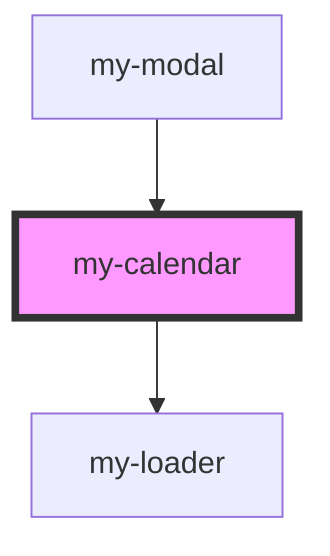

# my-calendar

<!-- Auto Generated Below -->

## Properties

| Property     | Attribute     | Description | Type  | Default     |
| ------------ | ------------- | ----------- | ----- | ----------- |
| `facilityId` | `facility-id` |             | `any` | `undefined` |

## Events

| Event        | Description | Type                    |
| ------------ | ----------- | ----------------------- |
| `stepChange` |             | `CustomEvent<StepData>` |

## Dependencies

### Used by

 - [my-modal](../my-modal)

### Depends on

- [my-loader](../my-loader)

### Graph

----------------------------------------------

*Built with [StencilJS](https://stenciljs.com/)*
