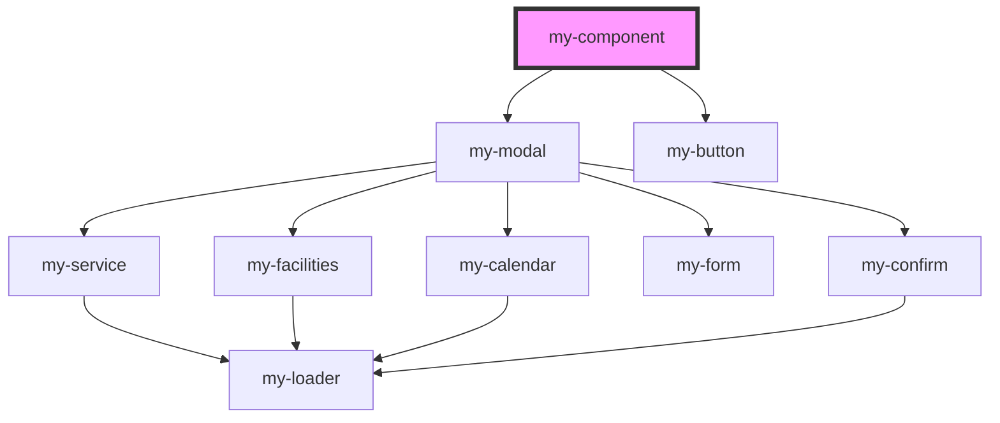

# my-component

<!-- Auto Generated Below -->

## Dependencies

### Depends on

- [my-modal](../my-modal)
- [my-button](../my-button)

### Graph

----------------------------------------------

*Built with [StencilJS](https://stenciljs.com/)*
