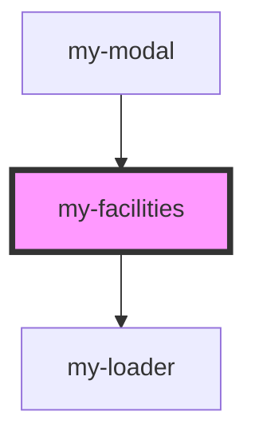

# my-facilities

<!-- Auto Generated Below -->

## Events

| Event        | Description | Type                    |
| ------------ | ----------- | ----------------------- |
| `stepChange` |             | `CustomEvent<StepData>` |

## Dependencies

### Used by

 - [my-modal](../my-modal)

### Depends on

- [my-loader](../my-loader)

### Graph

----------------------------------------------

*Built with [StencilJS](https://stenciljs.com/)*
