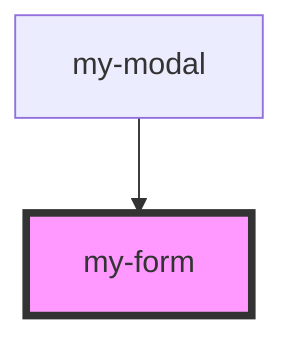

# my-form

<!-- Auto Generated Below -->

## Properties

| Property       | Attribute       | Description | Type  | Default     |
| -------------- | --------------- | ----------- | ----- | ----------- |
| `selectedTime` | `selected-time` |             | `any` | `undefined` |

## Events

| Event        | Description | Type                    |
| ------------ | ----------- | ----------------------- |
| `stepChange` |             | `CustomEvent<StepData>` |

## Dependencies

### Used by

 - [my-modal](../my-modal)

### Graph

----------------------------------------------

*Built with [StencilJS](https://stenciljs.com/)*
