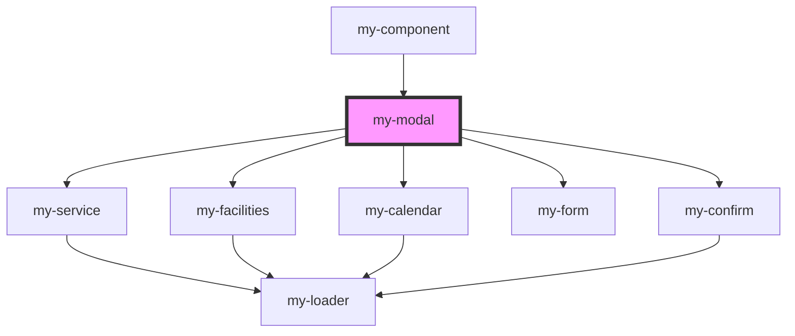

# my-modal

<!-- Auto Generated Below -->

## Dependencies

### Used by

 - [my-component](../my-component)

### Depends on

- [my-service](../my-service)
- [my-facilities](../my-facilities)
- [my-calendar](../my-calendar)
- [my-form](../my-form)
- [my-confirm](../my-confirm)

### Graph

----------------------------------------------

*Built with [StencilJS](https://stenciljs.com/)*
